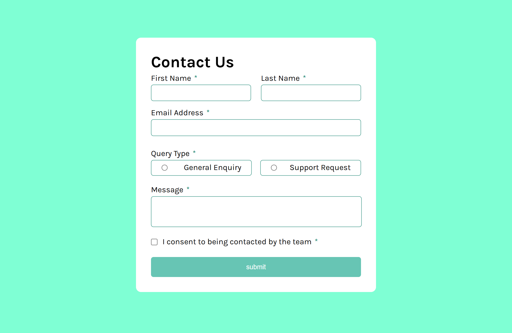

# Welcome to My Project

This project is a solution to a challenge from **Frontend Mentor Challenges**. The challenge focuses on implementing a user interface using modern web development tools and best practices.

---
# ScreenShot

---

## Technologies Used

In this challenge, I utilized the following technologies and tools:

- **TypeScript**: For static typing and improved developer experience.
- **React**: For building the user interface components.
- **CSS**: For styling the application.
- **React Hooks**:
  - **Portal**: For managing pop-ups efficiently.
  - **React Form**: For handling form inputs and validations.

---

## File Structure

The project is organized as follows:

```
src/
├── components/
|   ├── Form/
|   |   ├── Form.tsx        // Main form component
|   |   ├── form.css       // Styling for the form
|   |   └── FormDataType   // Type definitions for form data
|   └── Popup/
|       ├── Popup.tsx      // Main popup component
|       └── popup.css     // Styling for the popup
```

---

## Features

- **Form Handling**: A fully functional form built with React and TypeScript, ensuring type safety and easy state management.
- **Popup Management**: The pop-up is implemented using React Portal for optimal DOM handling and enhanced user experience.
- **Styling**: Clean and modular CSS for component-specific styles.

---

## How to Run the Project

1. Clone the repository:
   ```bash
   git clone https://github.com/khaduj03/front-end-mentor-challenges-part-3.git
   ```

2. Navigate to the project directory:
   ```bash
   cd contact-form-main
   ```

3. Install dependencies:
   ```bash
   npm install
   ```

4. Start the development server:
   ```bash
   npm run dev
   ```

5. Open your browser and go to:
   ```
   http://localhost:5173
   ```

---

## Additional Information

This project demonstrates my ability to work with modern front-end tools, handle component-based architecture, and apply responsive design principles. I welcome feedback and suggestions to improve this project further.

---

Thank you for checking out my project! Feel free to reach out if you have any questions or ideas.

